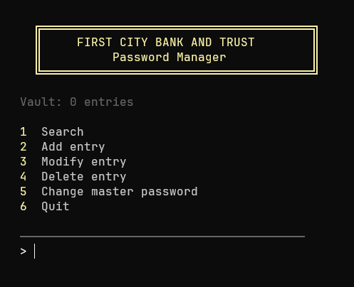
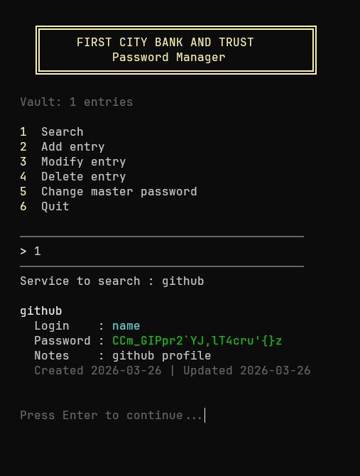

# FCBT - First City Bank and Trust

**A locally encrypted password manager built from scratch in Python.**

Your passwords never leave your machine. The vault is encrypted at rest with AES (Fernet) using PBKDF2 key derivation.

> Built as a personal project to demonstrate applied cryptography, clean architecture, and secure-by-default design.

---

## Why FCBT?

Most password managers require trusting a third party with your secrets. FCBT takes a different approach:

- **Zero network access** -- your vault lives on your machine
- **Strong encryption** -- AES-128 via Fernet with PBKDF2-SHA256 (100,000 iterations)
- **Minimal dependencies** -- only `cryptography`, everything else is stdlib
- **Transparent codebase** -- ~200 lines of auditable Python

---

## Features

| Feature | Description |
|---|---|
| **Encrypted vault** | AES via Fernet + PBKDF2 key derivation with per-save random salt |
| **CRUD operations** | Add, search, modify, and delete password entries |
| **Password generator** | Cryptographically secure generation via `secrets` (configurable length & charset) |
| **Master password** | Change it anytime -- the vault is re-encrypted transparently |
| **Colored CLI** | Clean terminal UI with visual feedback and navigation |

---

## Screenshots

<p align="center">
  
  
  
</p>

---

## Tech Stack

| Layer | Technology |
|---|---|
| Language | Python 3 |
| Encryption | `cryptography` (Fernet / AES-128-CBC + HMAC) |
| Key Derivation | PBKDF2-HMAC-SHA256, 100k iterations, 16-byte random salt |
| Random Source | `secrets` (CSPRNG) |
| Data Layer | JSON serialization, flat-file storage (`vault.dat`) |

---

## Architecture

```
fcbt/
  models.py      # Entry & Vault dataclasses
  crypto.py      # Key derivation (PBKDF2) + encrypt/decrypt (Fernet)
  generator.py   # Cryptographically secure password generation
  storage.py     # Vault persistence (salt + ciphertext in a single file)
  cli.py         # Interactive terminal interface
```

**Data flow:**

```
Master password
      |
      v
  PBKDF2-SHA256 (100k rounds + random salt)
      |
      v
  AES key (Fernet)
      |
      v
  Encrypt/Decrypt vault (JSON <-> bytes)
      |
      v
  vault.dat (salt || ciphertext)
```

---

## Security Model

| Property | Implementation |
|---|---|
| Encryption at rest | Fernet (AES-128-CBC + HMAC-SHA256) |
| Key derivation | PBKDF2-HMAC-SHA256, 100,000 iterations |
| Salt | 16 bytes, regenerated on every save |
| Authenticated encryption | Fernet provides integrity + confidentiality |
| Secure random | `secrets` module (OS-level CSPRNG) |
| No plaintext on disk | Vault is always encrypted before writing |

---

## Getting Started

### Prerequisites

- Python 3.8+

### Installation

```bash
git clone https://github.com/anderson3x11/fcbt.git
cd fcbt
python -m venv .venv
source .venv/bin/activate        # Linux/macOS
# .venv\Scripts\activate         # Windows
pip install cryptography
```

### Usage

```bash
python -m fcbt.cli
```

On first launch, you set a master password and an empty vault is created.
On subsequent launches, enter your master password to unlock the existing vault.
